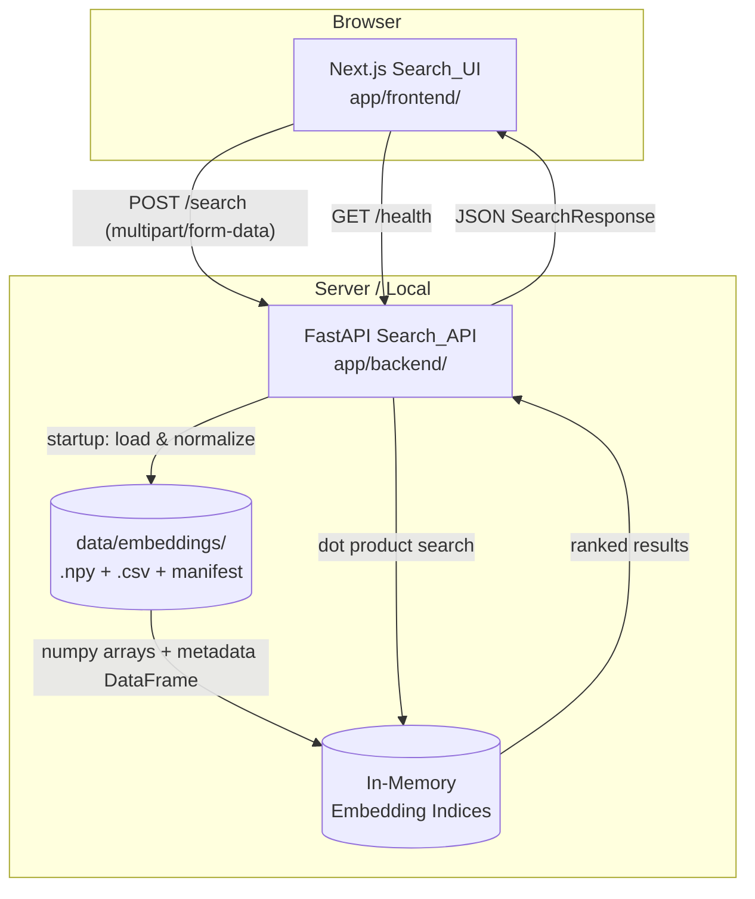

# Design Document: MET Art Search

## Overview

The MET Art Search application is a full-stack semantic search system for the Metropolitan Museum of Art collection. It consists of a FastAPI backend (`Search_API`) and a Next.js frontend (`Search_UI`), both housed under `app/`.

The backend loads pre-computed embeddings from disk at startup into memory-resident numpy arrays, then serves cosine similarity search via dot product (all vectors are unit-normalized at load time). Three independent embedding indices support three search modes: `text` (384-dim sentence-transformer), `image` (512-dim CLIP), and `joint` (896-dim concatenated). No re-training or re-embedding occurs at runtime.

The frontend presents a museum-quality interface with MET brand aesthetics, mobile-first responsive layout, and three search modes with intuitive controls.

### Key Design Decisions

- **In-memory index**: All ~45k embedding vectors are loaded once at startup. At 384/512/896 dims × float32 × 44,973 rows, total memory is ~300 MB — well within typical server limits and eliminates per-request I/O.
- **Dot product as cosine similarity**: Vectors are L2-normalized at load time, so `np.dot(query, index.T)` gives cosine similarity in O(n·d) time — fast enough for sub-second latency without an ANN index.
- **No cross-mode fallback**: Each mode uses its own index exclusively. A `text` query never touches the CLIP index.
- **Joint vector construction on the backend**: The weighted combination and normalization happen server-side to keep the frontend stateless with respect to embedding math.
- **Next.js App Router**: Used for the frontend to enable server components, easy API route proxying, and built-in image optimization.

---

## Architecture



### Request Flow

1. User submits a search from the browser.
2. Next.js frontend sends a `POST /search` multipart request to the FastAPI backend.
3. The backend's `Query_Encoder` encodes the text and/or image into a query vector using the appropriate model.
4. The `Similarity_Engine` computes dot products against the relevant in-memory index, argsorts, and slices the top-K results.
5. Metadata is looked up by row index from the in-memory DataFrame.
6. A `SearchResponse` JSON object is returned to the frontend.
7. The frontend renders `Artwork_Card` components in a responsive grid.

---

## Components and Interfaces

### Backend (`app/backend/`)

```
app/backend/
├── main.py              # FastAPI app, lifespan startup, CORS, routes
├── models.py            # Pydantic request/response schemas
├── index.py             # EmbeddingIndex: load, normalize, search
├── encoder.py           # QueryEncoder: text + image encoding
├── config.py            # Settings via pydantic-settings / .env
└── requirements.txt     # fastapi, uvicorn, numpy, torch, transformers, etc.
```

#### `index.py` — EmbeddingIndex

```python
class EmbeddingIndex:
    text_matrix: np.ndarray    # shape (44973, 384), float32, unit-normalized
    clip_matrix: np.ndarray    # shape (30724, 512), float32, unit-normalized
    joint_matrix: np.ndarray   # shape (N, 896), float32, unit-normalized
    metadata: pd.DataFrame     # 44973 rows, indexed by position
    manifest: dict

    def load(self, embeddings_dir: Path) -> None: ...
    def search(self, query_vec: np.ndarray, mode: SearchMode, top_k: int) -> list[SearchHit]: ...
```

`search()` selects the matrix by mode, computes `scores = matrix @ query_vec`, argsorts descending, and returns the top-K row indices with scores.

#### `encoder.py` — QueryEncoder

```python
class QueryEncoder:
    def encode_text(self, query: str) -> np.ndarray: ...       # (384,) float32, unit-normalized
    def encode_image(self, image: Image.Image) -> np.ndarray:  # (512,) float32, unit-normalized
    def encode_joint(
        self,
        text_vec: np.ndarray,
        image_vec: np.ndarray,
        text_weight: float,
    ) -> np.ndarray: ...  # normalize(text_weight * text_vec + (1-text_weight) * image_vec)
```

Models are loaded once at startup and reused across requests. The sentence-transformer and CLIP processor/model are held as instance attributes.

#### `main.py` — FastAPI App

Routes:
- `GET /health` → `HealthResponse`
- `POST /search` → `SearchResponse` (multipart/form-data)

The app uses FastAPI's `lifespan` context manager to load the `EmbeddingIndex` and `QueryEncoder` at startup and store them in `app.state`.

#### `models.py` — Pydantic Schemas

```python
class SearchMode(str, Enum):
    text = "text"
    image = "image"
    joint = "joint"

class ArtworkResult(BaseModel):
    object_id: int
    title: str
    artist_display_name: str | None
    object_date: str | None
    department: str | None
    medium: str | None
    primary_image_small: str | None
    primary_image: str | None
    object_url: str
    score: float
    is_highlight: bool

class SearchResponse(BaseModel):
    results: list[ArtworkResult]
    query_mode: SearchMode
    total_results: int
    text_weight: float | None = None

class HealthResponse(BaseModel):
    status: str
    rows: int
```

### Frontend (`app/frontend/`)

```
app/frontend/
├── app/
│   ├── layout.tsx           # Root layout: fonts, global styles, header
│   ├── page.tsx             # Home page: hero + search form + results
│   └── globals.css          # CSS variables, MET color palette, base styles
├── components/
│   ├── SearchForm.tsx        # Mode selector, text input, image upload, top-k, weight slider
│   ├── ArtworkCard.tsx       # Single result card
│   ├── ResultsGrid.tsx       # Responsive grid + count display
│   ├── LoadingState.tsx      # Animated loading indicator
│   └── HeroSection.tsx       # Pre-search hero with featured artwork
├── lib/
│   └── api.ts               # searchArtworks(), typed fetch wrapper
├── types/
│   └── search.ts            # TypeScript types mirroring backend schemas
└── package.json
```

#### `lib/api.ts`

```typescript
export async function searchArtworks(params: SearchParams): Promise<SearchResponse>
```

Builds a `FormData` object, POSTs to `NEXT_PUBLIC_API_URL/search`, and returns the typed response. Throws a typed `ApiError` on non-2xx responses.

#### `SearchForm` component

Manages local state: `mode`, `query`, `imageFile`, `textWeight`, `topK`. Validates inputs client-side before submission. Calls `searchArtworks()` and lifts results to the parent page via `onResults` callback.

---

## Data Models

### Embedding Index Layout

| Index | File                   | Shape        | Dtype   | Notes                     |
| ----- | ---------------------- | ------------ | ------- | ------------------------- |
| Text  | `text_embeddings.npy`  | (44973, 384) | float32 | All artworks              |
| CLIP  | `clip_embeddings.npy`  | (30724, 512) | float32 | Artworks with images only |
| Joint | `joint_embeddings.npy` | (N, 896)     | float32 | Artworks with both        |

Row `i` in each matrix corresponds to `manifest["rows"]`-aligned positions. The CLIP and joint matrices have their own row-to-object-id mapping stored in the metadata CSV (`clip_embedding_status == "embedded"` rows).

### Metadata CSV Columns (relevant subset)

| Column                  | Type | Notes                                                    |
| ----------------------- | ---- | -------------------------------------------------------- |
| `objectID`              | int  | MET object identifier                                    |
| `title`                 | str  | Artwork title                                            |
| `artistDisplayName`     | str  | Artist name (may be empty)                               |
| `objectDate`            | str  | Date string                                              |
| `department`            | str  | MET department                                           |
| `medium`                | str  | Medium description                                       |
| `primaryImageSmall`     | str  | CDN thumbnail URL                                        |
| `primaryImage`          | str  | Full-size image URL                                      |
| `objectURL`             | str  | MET website URL                                          |
| `isHighlight`           | bool | MET highlight flag                                       |
| `clip_embedding_status` | str  | `embedded` / `missing_url` / `download_or_decode_failed` |

### Joint Query Construction

```
joint_query = normalize(text_weight × text_vec + (1 − text_weight) × image_vec)
```

Where:
- `text_vec` ∈ ℝ³⁸⁴, unit-normalized output of sentence-transformer
- `image_vec` ∈ ℝ⁵¹²`, unit-normalized output of CLIP
- `text_weight` ∈ [0.0, 1.0], default 0.5
- The weighted sum is a 896-dim vector (384 + 512) before normalization
- After normalization, dot product against the joint index gives cosine similarity

### API Request/Response

**POST /search** — `multipart/form-data`

| Field         | Type   | Required    | Notes                                 |
| ------------- | ------ | ----------- | ------------------------------------- |
| `mode`        | string | yes         | `text` / `image` / `joint`            |
| `query`       | string | conditional | Required for `text` and `joint`       |
| `image`       | file   | conditional | Required for `image` and `joint`      |
| `top_k`       | int    | no          | 10/20/50/100, default 20              |
| `text_weight` | float  | no          | [0.0, 1.0], default 0.5, `joint` only |

**SearchResponse JSON**

```json
{
  "results": [
    {
      "object_id": 436535,
      "title": "Self-Portrait with a Straw Hat",
      "artist_display_name": "Vincent van Gogh",
      "object_date": "1887",
      "department": "European Paintings",
      "medium": "Oil on canvas",
      "primary_image_small": "https://images.metmuseum.org/...",
      "primary_image": "https://images.metmuseum.org/...",
      "object_url": "https://www.metmuseum.org/art/collection/search/436535",
      "score": 0.923,
      "is_highlight": true
    }
  ],
  "query_mode": "text",
  "total_results": 20,
  "text_weight": null
}
```

---

## Correctness Properties

*A property is a characteristic or behavior that should hold true across all valid executions of a system — essentially, a formal statement about what the system should do. Properties serve as the bridge between human-readable specifications and machine-verifiable correctness guarantees.*

### Property 1: Manifest row count validation

*For any* embedding matrix and manifest, the validation function SHALL accept the matrix if and only if `matrix.shape[0] == manifest["rows"]`, and SHALL reject it otherwise.

**Validates: Requirements 1.2, 1.4**

---

### Property 2: Index normalization invariant

*For any* float32 matrix loaded by `EmbeddingIndex.load()`, after normalization every row vector SHALL have L2 norm within 1e-5 of 1.0.

**Validates: Requirements 1.5**

---

### Property 3: Text encoder output invariant

*For any* non-empty string, `QueryEncoder.encode_text()` SHALL return a float32 vector of shape (384,) with L2 norm within 1e-5 of 1.0.

**Validates: Requirements 2.1**

---

### Property 4: Image encoder output invariant

*For any* valid RGB image (any size, any pixel values), `QueryEncoder.encode_image()` SHALL return a float32 vector of shape (512,) with L2 norm within 1e-5 of 1.0.

**Validates: Requirements 3.1**

---

### Property 5: Search correctness — true top-K, sorted descending

*For any* unit-normalized query vector, any unit-normalized index matrix, and any valid `top_k` value, `EmbeddingIndex.search()` SHALL return exactly `min(top_k, index_size)` results whose scores are the true highest dot-product scores in the index, sorted in strictly non-increasing order.

**Validates: Requirements 2.2, 3.2, 4.3, 5.4**

---

### Property 6: top_k result count invariant

*For any* valid search request with `top_k` ∈ {10, 20, 50, 100}, the Search_API SHALL return exactly `min(top_k, index_size)` results in the `results` array, and `total_results` SHALL equal `len(results)`.

**Validates: Requirements 2.5, 3.7, 4.8**

---

### Property 7: Whitespace query rejection

*For any* string composed entirely of whitespace characters (spaces, tabs, newlines, or any combination), a text or joint search request using that string as the query SHALL be rejected with HTTP 422.

**Validates: Requirements 2.4**

---

### Property 8: Image upload validation

*For any* file submitted as an image upload: if the file is a valid JPEG, PNG, or WebP image with size ≤ 10 MB, the Search_API SHALL accept it; if the file exceeds 10 MB or is not a valid image in one of those formats, the Search_API SHALL return HTTP 422.

**Validates: Requirements 3.3, 3.4**

---

### Property 9: CLIP-only results for image mode

*For any* image search query, every artwork in the returned results SHALL have `clip_embedding_status = "embedded"` in the metadata; no artwork without a CLIP embedding SHALL appear in image search results.

**Validates: Requirements 3.6**

---

### Property 10: Joint vector construction

*For any* unit-normalized text vector `t` ∈ ℝ³⁸⁴, unit-normalized image vector `v` ∈ ℝ⁵¹², and `text_weight` ∈ [0.0, 1.0], `QueryEncoder.encode_joint(t, v, text_weight)` SHALL return a vector equal to `normalize(text_weight * t + (1 - text_weight) * v)` with L2 norm within 1e-5 of 1.0.

**Validates: Requirements 4.2**

---

### Property 11: text_weight range validation

*For any* float value `w`: if `w` ∈ [0.0, 1.0], a joint search request with `text_weight=w` SHALL be accepted; if `w < 0.0` or `w > 1.0`, the Search_API SHALL return HTTP 422.

**Validates: Requirements 4.4**

---

### Property 12: Search response schema invariants

*For any* valid search request across any mode, the Search_API response SHALL contain: a `results` array, a `query_mode` string matching the requested mode, a `total_results` integer equal to `len(results)`, and `text_weight` present (as a float) if and only if `query_mode == "joint"`. Every item in `results` SHALL contain all required fields: `object_id` (int), `title` (str), `artist_display_name` (str or null), `object_date` (str or null), `department` (str or null), `medium` (str or null), `primary_image_small` (str or null), `primary_image` (str or null), `object_url` (str), `score` (float in [0, 1]), and `is_highlight` (bool).

**Validates: Requirements 5.1, 5.2, 5.3**

---

### Property 13: ArtworkCard renders required fields

*For any* `ArtworkResult` object, the rendered `ArtworkCard` component SHALL include the artwork's title, artist display name (or a placeholder if null), object date, and department in its output.

**Validates: Requirements 8.2**

---

## Error Handling

### Backend Error Handling

| Scenario                        | HTTP Status | Response                                                                                                          |
| ------------------------------- | ----------- | ----------------------------------------------------------------------------------------------------------------- |
| Empty/whitespace query string   | 422         | `{"detail": "Query string must not be empty"}`                                                                    |
| Invalid image format            | 422         | `{"detail": "Image must be JPEG, PNG, or WebP"}`                                                                  |
| Image exceeds 10 MB             | 422         | `{"detail": "Image file size must not exceed 10 MB"}`                                                             |
| Joint mode: text only, no image | 422         | `{"detail": "Joint mode requires both a text query and an image; provide an image or switch to text mode."}`      |
| Joint mode: image only, no text | 422         | `{"detail": "Joint mode requires both a text query and an image; provide a text query or switch to image mode."}` |
| Invalid top_k value             | 422         | `{"detail": "top_k must be one of: 10, 20, 50, 100"}`                                                             |
| text_weight out of range        | 422         | `{"detail": "text_weight must be between 0.0 and 1.0"}`                                                           |
| Startup: missing embedding file | Exit 1      | Logged to stderr: `"Missing embedding file: {path}"`                                                              |
| Startup: row count mismatch     | Exit 1      | Logged to stderr: `"Row count mismatch for {file}: expected {manifest_rows}, got {actual_rows}"`                  |
| Encoder model load failure      | Exit 1      | Logged to stderr: `"Failed to load model {model_name}: {error}"`                                                  |

All 422 responses use FastAPI's standard `{"detail": "..."}` format. Unhandled exceptions return 500 with a generic message; stack traces are logged server-side only.

### Frontend Error Handling

- **Client-side validation**: Checked before any API call; inline messages displayed near the relevant control.
- **API error responses**: The `api.ts` wrapper parses the `detail` field from 422 responses and surfaces it as a user-facing error banner.
- **Network errors / 500s**: Display a generic "Something went wrong. Please try again." banner.
- **Image load failures in results**: `ArtworkCard` uses `onError` on the `` tag to swap in the placeholder.

---

## Testing Strategy

### Dual Testing Approach

Both unit/property tests and integration tests are used. Property-based tests verify universal correctness properties across many generated inputs; unit tests cover specific examples and error conditions; integration tests verify end-to-end behavior.

### Backend Testing

**Property-Based Testing** (using [Hypothesis](https://hypothesis.readthedocs.io/) for Python):

Each property test runs a minimum of 100 iterations. Tests are tagged with the design property they validate.

| Test                                              | Property    | Library    |
| ------------------------------------------------- | ----------- | ---------- |
| Manifest validation accepts iff rows match        | Property 1  | Hypothesis |
| All rows unit-normalized after load               | Property 2  | Hypothesis |
| Text encoder output shape and norm                | Property 3  | Hypothesis |
| Image encoder output shape and norm               | Property 4  | Hypothesis |
| Search returns true top-K sorted descending       | Property 5  | Hypothesis |
| Result count equals min(top_k, index_size)        | Property 6  | Hypothesis |
| Whitespace queries rejected with 422              | Property 7  | Hypothesis |
| Image format/size validation                      | Property 8  | Hypothesis |
| Image results only contain CLIP-embedded artworks | Property 9  | Hypothesis |
| Joint vector formula and unit norm                | Property 10 | Hypothesis |
| text_weight range validation                      | Property 11 | Hypothesis |
| Response schema completeness across all modes     | Property 12 | Hypothesis |

Tag format: `# Feature: met-art-search, Property {N}: {property_text}`

**Unit / Example Tests** (pytest):

- Startup exits with non-zero code when embedding files are missing (Req 1.3)
- Joint mode returns correct error messages for missing text / missing image (Req 4.5, 4.6)
- `/health` returns `{"status": "ok", "rows": N}` (Req 9.1)
- CORS preflight OPTIONS returns correct headers (Req 9.3)
- Default `top_k` is 20 when not specified (Req 2.5, 3.7, 4.8)
- Default `text_weight` is 0.5 when not specified (Req 4.4)

**Integration Tests**:

- Text search latency < 2s against full index (Req 2.3)
- Image search latency < 3s against full index (Req 3.5)
- Joint search latency < 4s against full index (Req 4.7)
- CORS headers present on search responses from allowed origin (Req 9.2)

### Frontend Testing

**Component Tests** (Jest + React Testing Library):

- `ArtworkCard` renders all required fields for any `ArtworkResult` (Property 13)
- `SearchForm` disables image upload when mode is "Text" (Req 7.4)
- `SearchForm` disables text input when mode is "Image" (Req 7.5)
- `SearchForm` enables both controls when mode is "Text + Image" (Req 7.6)
- `SearchForm` shows inline validation message for empty text in Text mode (Req 7.9)
- `SearchForm` shows inline validation message for missing image in Image mode (Req 7.10)
- `SearchForm` shows inline validation message for incomplete joint mode (Req 7.11)
- `ResultsGrid` shows "No artworks found." when results array is empty (Req 8.6)
- `ResultsGrid` displays correct count string (Req 8.5)

**Snapshot Tests**: `ArtworkCard`, `HeroSection`, `LoadingState` for visual regression.

### Test Configuration

```
# Backend
pytest app/backend/tests/ --hypothesis-seed=0

# Frontend
jest app/frontend/ --testPathPattern="\.test\.(ts|tsx)$"
```

Property tests use `@settings(max_examples=100)` (Hypothesis default) with a fixed seed for reproducibility in CI.
