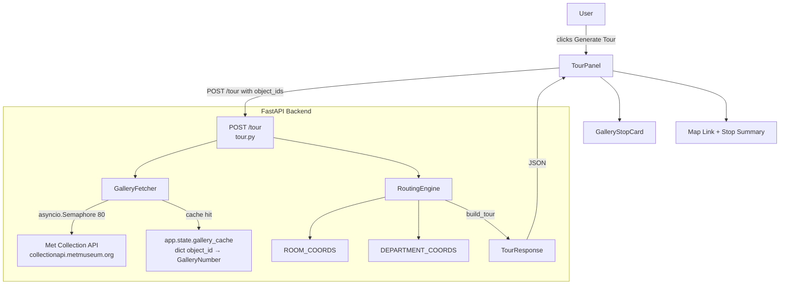

# Design Document: Tour Guide Routing

## Overview

The Tour Guide Routing feature extends the MET Museum art search app with a physical visit planner. After a semantic search, users can generate an optimized walking tour through the Met's Fifth Avenue building. The backend fetches gallery numbers from the Met Collection API, resolves spatial coordinates from hardcoded room/department maps, and computes a floor-by-floor nearest-neighbor route refined with 2-opt local search. The frontend renders the ordered tour as a list of gallery stops with artwork thumbnails and a link to the Met's interactive map.

The feature is additive — it does not modify existing search behavior. The `POST /tour` endpoint is independent of `/search`, and the `TourPanel` component renders below the existing `ResultsGrid`.

---

## Architecture



**Data flow:**
1. Frontend sends `POST /tour` with a list of `object_id` integers from current search results.
2. `GalleryFetcher` concurrently fetches `GalleryNumber` for each ID from the Met Collection API, respecting an 80-concurrent-request semaphore and using an in-memory cache on `app.state`.
3. `RoutingEngine` resolves coordinates (ROOM_COORDS → DEPARTMENT_COORDS → sentinel), filters out Cloisters and unroutable artworks, partitions by floor, runs greedy nearest-neighbor + 2-opt per floor, and groups results into `GalleryStop` objects.
4. The response is returned as a `TourResponse` JSON object.
5. `TourPanel` renders the ordered stops; `GalleryStopCard` renders each stop's artworks.

---

## Components and Interfaces

### Backend: `app/backend/tour.py`

This new module contains all tour-related logic and the endpoint registration function.

```
tour.py
├── ROOM_COORDS: dict[str, tuple[float, float, int]]       # ~400 gallery entries
├── DEPARTMENT_COORDS: dict[str, tuple[float, float, int]] # department centroids
├── FLOOR_PENALTY: float = 8.0
├── GREAT_HALL: tuple[float, float, float]
│
├── get_coords(artwork: dict) -> tuple[float, float, float]
├── coords_array(artworks: list[dict]) -> np.ndarray
├── total_distance(route: list[dict]) -> float
├── two_opt(route: list[dict]) -> list[dict]
├── nearest_neighbor_route(artworks: list[dict]) -> list[dict]
├── group_by_stop(artworks: list[dict]) -> dict[str, list[dict]]
│
├── fetch_gallery_number(object_id: int, cache, client) -> str | None  [async]
├── fetch_all_gallery_numbers(object_ids, cache, client) -> dict[int, str | None]  [async]
│
└── tour_endpoint(request: TourRequest, app_state) -> TourResponse  [async]
```

The routing functions are ported directly from `met_tour_routing.py` with minimal changes (removing the pandas/CSV dependency, accepting plain dicts).

**Registration in `main.py`:** The lifespan function initializes `app.state.gallery_cache = {}`. The endpoint is registered via `app.include_router(tour_router)` or directly as `app.post("/tour")`.

### Backend: `app/backend/models.py` additions

Four new Pydantic models are added to the existing `models.py`:

```python
class TourArtwork(BaseModel):
    object_id: int
    title: str
    artist_display_name: str | None
    primary_image_small: str | None
    object_url: str

class GalleryStop(BaseModel):
    stop_label: str
    floor: int
    artworks: list[TourArtwork]

class TourRequest(BaseModel):
    object_ids: list[int] = Field(min_length=1, max_length=100)

class TourResponse(BaseModel):
    stops: list[GalleryStop]
    total_input: int
    routable_count: int
    excluded_count: int
```

### Frontend: New files

| File                                          | Purpose                                                       |
| --------------------------------------------- | ------------------------------------------------------------- |
| `app/frontend/types/tour.ts`                  | TypeScript types mirroring backend models                     |
| `app/frontend/lib/tourApi.ts`                 | `generateTour(objectIds: number[])` API call                  |
| `app/frontend/components/TourPanel.tsx`       | "Generate Tour" button, loading state, stop list, error/retry |
| `app/frontend/components/GalleryStopCard.tsx` | Renders a single gallery stop with its artworks               |

### Frontend: Modified files

| File                        | Change                                                                                              |
| --------------------------- | --------------------------------------------------------------------------------------------------- |
| `app/frontend/app/page.tsx` | Renders `<TourPanel>` below `<ResultsGrid>`, passing `searchResponse.results.map(r => r.object_id)` |

---

## Data Models

### Backend Pydantic Models

```python
# Slim artwork representation for tour display
class TourArtwork(BaseModel):
    object_id: int
    title: str
    artist_display_name: str | None
    primary_image_small: str | None
    object_url: str

# A single physical stop in the tour
class GalleryStop(BaseModel):
    stop_label: str          # "Gallery 601", "European Paintings", or "Unknown Location"
    floor: int               # 1 or 2 (derived from z / FLOOR_PENALTY)
    artworks: list[TourArtwork]

# Request body for POST /tour
class TourRequest(BaseModel):
    object_ids: list[int] = Field(min_length=1, max_length=100)

# Response from POST /tour
class TourResponse(BaseModel):
    stops: list[GalleryStop]
    total_input: int         # len(object_ids) from request
    routable_count: int      # artworks included in stops
    excluded_count: int      # total_input - routable_count
```

### Frontend TypeScript Types (`types/tour.ts`)

```typescript
export interface TourArtwork {
  object_id: number;
  title: string;
  artist_display_name: string | null;
  primary_image_small: string | null;
  object_url: string;
}

export interface GalleryStop {
  stop_label: string;
  floor: number;
  artworks: TourArtwork[];
}

export interface TourResponse {
  stops: GalleryStop[];
  total_input: number;
  routable_count: number;
  excluded_count: number;
}

export interface TourRequest {
  object_ids: number[];
}
```

---

## Backend Component Design

### Gallery Fetcher

The fetcher uses `httpx.AsyncClient` with `asyncio.Semaphore(80)` to respect the Met API rate limit. Results are cached in `app.state.gallery_cache` (a plain `dict[int, str | None]`) initialized during the FastAPI lifespan.

```python
MET_OBJECT_URL = "https://collectionapi.metmuseum.org/public/collection/v1/objects/{}"
_SEMAPHORE = asyncio.Semaphore(80)

async def fetch_gallery_number(
    object_id: int,
    cache: dict[int, str | None],
    client: httpx.AsyncClient,
) -> str | None:
    if object_id in cache:
        return cache[object_id]
    async with _SEMAPHORE:
        try:
            resp = await client.get(MET_OBJECT_URL.format(object_id), timeout=5.0)
            resp.raise_for_status()
            data = resp.json()
            gallery = (data.get("GalleryNumber") or "").strip() or None
        except Exception:
            gallery = None
    cache[object_id] = gallery
    return gallery

async def fetch_all_gallery_numbers(
    object_ids: list[int],
    cache: dict[int, str | None],
    client: httpx.AsyncClient,
) -> dict[int, str | None]:
    tasks = [fetch_gallery_number(oid, cache, client) for oid in object_ids]
    results = await asyncio.gather(*tasks)
    return dict(zip(object_ids, results))
```

The `httpx.AsyncClient` is created per-request (or shared via lifespan — see Error Handling section for the tradeoff).

### Routing Pipeline

The routing pipeline maps directly from `met_tour_routing.py`:

```
Input: list of artwork dicts (object_id, title, artist_display_name,
       primary_image_small, object_url, GalleryNumber, department)
       
Step 1: Filter — remove Cloisters artworks
Step 2: Coordinate resolution — get_coords() per artwork
         → ROOM_COORDS[GalleryNumber] if present
         → DEPARTMENT_COORDS[department] if present  
         → sentinel (99, 99, 99) otherwise
Step 3: Filter routable — exclude sentinel artworks
Step 4: Floor partition — floor1, floor2, other
         (floor = int(z // FLOOR_PENALTY))
Step 5: Per-floor greedy nearest-neighbor starting from GREAT_HALL
Step 6: Per-floor 2-opt refinement
Step 7: Concatenate: floor1 → floor2 → other
Step 8: group_by_stop() — group consecutive artworks by stop label
Step 9: Build GalleryStop objects with floor derived from first artwork's coords
```

**Key mapping from `met_tour_routing.py`:**

| Original function                  | Role in `tour.py`                                       |
| ---------------------------------- | ------------------------------------------------------- |
| `get_coords(artwork)`              | Unchanged — coordinate lookup                           |
| `coords_array(artworks)`           | Unchanged — numpy array builder                         |
| `total_distance(route)`            | Unchanged — path length                                 |
| `two_opt(route)`                   | Unchanged — local search                                |
| `nearest_neighbor_route(artworks)` | Unchanged — main routing                                |
| `group_by_stop(artworks)`          | Adapted — returns `list[GalleryStop]` instead of `dict` |
| `build_tour(artworks)`             | Becomes the core of `tour_endpoint`                     |

The `group_by_stop` adaptation converts the dict output into an ordered `list[GalleryStop]`, deriving `floor` from the first artwork in each group's coordinates.

### POST /tour Endpoint

```python
@app.post("/tour", response_model=TourResponse)
async def tour(request: TourRequest) -> TourResponse:
    cache: dict = app.state.gallery_cache
    
    async with httpx.AsyncClient() as client:
        gallery_map = await fetch_all_gallery_numbers(
            request.object_ids, cache, client
        )
    
    # Build artwork dicts for routing (merge search metadata with gallery numbers)
    # Note: artwork metadata (title, artist, etc.) must come from the request
    # or be looked up — see "Design Decision: Artwork Metadata" below
    
    artworks = build_artwork_dicts(request, gallery_map)
    
    # Filter Cloisters
    artworks = [a for a in artworks if a.get("department") != "The Cloisters"]
    
    # Route
    stops = build_gallery_stops(artworks)
    
    routable_count = sum(len(s.artworks) for s in stops)
    excluded_count = len(request.object_ids) - routable_count
    
    return TourResponse(
        stops=stops,
        total_input=len(request.object_ids),
        routable_count=routable_count,
        excluded_count=excluded_count,
    )
```

**Design Decision: Artwork Metadata in TourRequest**

The `POST /tour` endpoint needs artwork metadata (title, artist, thumbnail, department) to build routing dicts and populate `TourArtwork` objects. Two options:

- **Option A (chosen):** The frontend sends full artwork metadata in the request body alongside `object_ids`. The `TourRequest` model includes a `artworks` field with slim artwork data. This avoids a second lookup into the embedding index and keeps the endpoint self-contained.
- **Option B:** The backend looks up metadata from the embedding index by object_id. This requires the index to support object_id lookup, which it currently does not.

**Revised TourRequest:**

```python
class TourArtworkInput(BaseModel):
    object_id: int
    title: str
    artist_display_name: str | None = None
    primary_image_small: str | None = None
    object_url: str
    department: str | None = None

class TourRequest(BaseModel):
    artworks: list[TourArtworkInput] = Field(min_length=1, max_length=100)
```

The frontend passes the full `ArtworkResult` list from the search response (minus fields not needed for routing).

---

## API Endpoint Specification

### `POST /tour`

**Request body:**
```json
{
  "artworks": [
    {
      "object_id": 460813,
      "title": "Self-Portrait with a Straw Hat",
      "artist_display_name": "Vincent van Gogh",
      "primary_image_small": "https://images.metmuseum.org/...",
      "object_url": "https://www.metmuseum.org/art/collection/search/460813",
      "department": "European Paintings"
    }
  ]
}
```

**Validation:**
- `artworks` must have 1–100 items → 422 if empty or > 100
- Each `object_id` must be a positive integer

**Success response (200):**
```json
{
  "stops": [
    {
      "stop_label": "Gallery 825",
      "floor": 2,
      "artworks": [
        {
          "object_id": 460813,
          "title": "Self-Portrait with a Straw Hat",
          "artist_display_name": "Vincent van Gogh",
          "primary_image_small": "https://images.metmuseum.org/...",
          "object_url": "https://www.metmuseum.org/art/collection/search/460813"
        }
      ]
    }
  ],
  "total_input": 1,
  "routable_count": 1,
  "excluded_count": 0
}
```

**Error responses:**
| Status | Condition                             |
| ------ | ------------------------------------- |
| 422    | Empty artworks list                   |
| 422    | More than 100 artworks                |
| 422    | Invalid field types                   |
| 504    | Met Collection API timeout (upstream) |

---

## Frontend Component Design

### `TourPanel.tsx`

Top-level component rendered in `page.tsx` below `ResultsGrid`. Manages tour state.

**Props:**
```typescript
interface TourPanelProps {
  artworks: ArtworkResult[];  // current search results
}
```

**State:**
```typescript
type TourState =
  | { status: "idle" }
  | { status: "loading" }
  | { status: "success"; data: TourResponse }
  | { status: "error"; message: string };
```

**Render logic:**
- `idle`: Show "Generate Tour" button (only if `artworks.length > 0`)
- `loading`: Show loading spinner with "Planning your tour…" message
- `success` with stops: Render stop count summary, map link, list of `GalleryStopCard`, excluded count note
- `success` with empty stops: Show "None of your search results could be located in the museum" message
- `error`: Show error message + "Try Again" button

### `GalleryStopCard.tsx`

Renders a single `GalleryStop`.

**Props:**
```typescript
interface GalleryStopCardProps {
  stop: GalleryStop;
  stopNumber: number;
}
```

**Layout:**
- Stop number badge (met-red background)
- Stop label (bold, met-charcoal)
- Floor indicator ("Floor 1" / "Floor 2")
- Horizontal scroll row of artwork thumbnails, each showing:
  - `primary_image_small` (or placeholder if null)
  - `title` (truncated)
  - `artist_display_name`

### `tourApi.ts`

```typescript
export async function generateTour(
  artworks: ArtworkResult[]
): Promise<TourResponse> {
  const body: TourRequest = {
    artworks: artworks.map(a => ({
      object_id: a.object_id,
      title: a.title,
      artist_display_name: a.artist_display_name,
      primary_image_small: a.primary_image_small,
      object_url: a.object_url,
      department: a.department,
    })),
  };

  const response = await fetch(`${API_URL}/tour`, {
    method: "POST",
    headers: { "Content-Type": "application/json" },
    body: JSON.stringify(body),
  });

  if (!response.ok) {
    const detail = await response.json().catch(() => ({}));
    throw new ApiError(detail?.detail ?? `HTTP ${response.status}`, detail?.detail);
  }

  return response.json() as Promise<TourResponse>;
}
```

### `page.tsx` integration

```tsx
{!isLoading && searchResponse && (
  <>
    <ResultsGrid ... />
    <TourPanel artworks={searchResponse.results} />
  </>
)}
```

### Met Interactive Map Link

The Met Interactive Map at `https://maps.metmuseum.org` does not have a documented deep-link URL parameter API. The `Route_Visualizer` section of `TourPanel` will:
1. Always link to `https://maps.metmuseum.org` (opens in new tab)
2. Display a readable gallery number summary: "Galleries: 825 → 826 → 800 → …"
3. If the Met map URL parameter format becomes known, the first stop's gallery number can be appended as a query param

---

## Correctness Properties

*A property is a characteristic or behavior that should hold true across all valid executions of a system — essentially, a formal statement about what the system should do. Properties serve as the bridge between human-readable specifications and machine-verifiable correctness guarantees.*

**Property Reflection:** After prework analysis, the following consolidations were made:
- Requirements 2.5 and 3.3 both test floor z-encoding — merged into Property 1.
- Requirements 2.2 and 3.5 both test `get_coords` fallback behavior — merged into Property 2.
- Requirements 1.6 and 3.4 both test Cloisters/unroutable filtering — merged into Property 3.
- Requirements 8.1, 8.2, and 8.3 all test serialization correctness — merged into Property 7.

### Property 1: Floor penalty encoding

*For any* artwork with a known floor number N (1 or 2), `get_coords` SHALL return a z-coordinate equal to `N × 8.0`, so that Euclidean distance calculations naturally penalize floor changes.

**Validates: Requirements 2.5, 3.3**

### Property 2: Coordinate resolution priority

*For any* artwork dict, `get_coords` SHALL return the ROOM_COORDS value when the artwork's `GalleryNumber` is present in ROOM_COORDS; otherwise the DEPARTMENT_COORDS value when the artwork's `department` is present in DEPARTMENT_COORDS; otherwise the sentinel `(99.0, 99.0, 99.0)`.

**Validates: Requirements 2.2, 3.5**

### Property 3: Cloisters and unroutable artworks excluded from tour

*For any* set of input artworks, the resulting tour route SHALL contain no artwork whose `department` is "The Cloisters", and SHALL contain no artwork whose coordinates resolved to the sentinel `(99.0, 99.0, 99.0)`.

**Validates: Requirements 1.6, 3.4**

### Property 4: 2-opt never worsens a route

*For any* list of artworks on a single floor, the total Euclidean path distance of the 2-opt result SHALL be less than or equal to the total distance of the greedy nearest-neighbor input route.

**Validates: Requirements 2.4**

### Property 5: Non-empty routable input produces non-empty tour

*For any* non-empty list of routable artworks (at least one artwork with a gallery in ROOM_COORDS or a department in DEPARTMENT_COORDS, excluding Cloisters), `build_tour` SHALL return a non-empty list of `GalleryStop` objects.

**Validates: Requirements 2.6**

### Property 6: Response counts are consistent

*For any* valid `TourResponse`, `total_input` SHALL equal the number of artworks in the original request, `routable_count` SHALL equal the total number of artworks across all stops, and `excluded_count` SHALL equal `total_input - routable_count`.

**Validates: Requirements 4.6**

### Property 7: TourResponse serialization round-trip

*For any* valid `TourResponse` object, serializing to JSON and deserializing back SHALL produce an equivalent `TourResponse` with identical `stops`, `total_input`, `routable_count`, and `excluded_count` values, and every `GalleryStop` SHALL contain non-null `stop_label`, `floor`, and `artworks` fields.

**Validates: Requirements 8.1, 8.2, 8.3**

### Property 8: Department-only artworks are routable, not excluded

*For any* artwork that has no `GalleryNumber` (or one not in ROOM_COORDS) but has a `department` present in DEPARTMENT_COORDS, that artwork SHALL appear in the tour stops and SHALL NOT be counted in `excluded_count`.

**Validates: Requirements 7.4**

### Property 9: Stop label assignment follows priority

*For any* artwork in the routed output, its parent `GalleryStop.stop_label` SHALL be `"Gallery {GalleryNumber}"` when the artwork's `GalleryNumber` is present in ROOM_COORDS; the department name when only a department centroid was used; and `"Unknown Location"` otherwise.

**Validates: Requirements 2.9**

---

## Error Handling

### Gallery Fetcher Errors

| Scenario                          | Behavior                                                                         |
| --------------------------------- | -------------------------------------------------------------------------------- |
| Met API HTTP error (4xx/5xx)      | Catch exception, treat as `GalleryNumber = None`, fall back to department coords |
| Met API timeout (>5s per request) | `httpx` timeout raises, caught as above                                          |
| Met API network unreachable       | Caught as above — all artworks fall back to department coords                    |
| Invalid JSON response             | Caught as above                                                                  |

The fetcher never raises to the caller — it always returns `str | None`. This ensures a partial Met API outage degrades gracefully to department-level routing rather than failing the entire tour request.

### Routing Edge Cases

| Scenario                          | Behavior                                                                                        |
| --------------------------------- | ----------------------------------------------------------------------------------------------- |
| All artworks are Cloisters        | Returns `TourResponse(stops=[], total_input=N, routable_count=0, excluded_count=N)`             |
| All artworks have sentinel coords | Same as above                                                                                   |
| Single routable artwork           | Returns one `GalleryStop` with one artwork                                                      |
| All artworks on same floor        | Route contains only floor 1 or floor 2 group; other groups are empty and skipped                |
| Duplicate object IDs in request   | Fetcher deduplicates via cache; routing includes duplicates as-is (frontend should deduplicate) |

### API Validation Errors

FastAPI's Pydantic validation handles:
- Empty `artworks` list → 422 with `"artworks: List should have at least 1 item"`
- More than 100 artworks → 422 with `"artworks: List should have at most 100 items"`
- Missing required fields → 422 with field-level detail

### Frontend Error Handling

- Network failure → `TourState.error` with "Could not reach the server. Please try again."
- API 422 → `TourState.error` with the detail message from the response body
- API 5xx → `TourState.error` with generic "Tour generation failed. Please try again."
- Empty tour response → `TourState.success` with `data.stops === []`, renders "no routable artworks" message

---

## Testing Strategy

### Unit Tests (Python, pytest)

Focus on pure routing functions that have no external dependencies:

- `get_coords` with gallery present, department present, neither present, Cloisters
- `total_distance` with known coordinate sequences
- `two_opt` on small routes — verify result distance ≤ input distance
- `nearest_neighbor_route` on small fixture sets — verify output is a permutation of input
- `group_by_stop` — verify stop labels follow priority rules
- `TourResponse` field validation — verify required fields present

### Property-Based Tests (Python, Hypothesis)

Each property test runs a minimum of 100 iterations. Tests are tagged with the property they validate.

**Library:** [Hypothesis](https://hypothesis.readthedocs.io/) for Python

```python
# Feature: tour-guide-routing, Property 1: Floor penalty encoding
@given(floor=st.integers(min_value=1, max_value=2),
       gallery=st.sampled_from(list(ROOM_COORDS.keys())))
def test_floor_penalty_encoding(floor, gallery): ...

# Feature: tour-guide-routing, Property 2: Coordinate resolution priority
@given(artwork=artwork_strategy())
def test_coordinate_resolution_priority(artwork): ...

# Feature: tour-guide-routing, Property 3: Cloisters excluded
@given(artworks=st.lists(artwork_strategy(), min_size=1))
def test_cloisters_excluded(artworks): ...

# Feature: tour-guide-routing, Property 4: 2-opt never worsens route
@given(artworks=st.lists(routable_artwork_strategy(), min_size=2, max_size=20))
def test_two_opt_never_worsens(artworks): ...

# Feature: tour-guide-routing, Property 5: Non-empty routable input → non-empty tour
@given(artworks=st.lists(routable_artwork_strategy(), min_size=1, max_size=20))
def test_nonempty_routable_produces_nonempty_tour(artworks): ...

# Feature: tour-guide-routing, Property 6: Response counts consistent
@given(artworks=st.lists(artwork_strategy(), min_size=1, max_size=20))
def test_response_counts_consistent(artworks): ...

# Feature: tour-guide-routing, Property 7: TourResponse round-trip
@given(response=tour_response_strategy())
def test_tour_response_round_trip(response): ...

# Feature: tour-guide-routing, Property 8: Department-only artworks routable
@given(artwork=department_only_artwork_strategy())
def test_department_only_artwork_routable(artwork): ...

# Feature: tour-guide-routing, Property 9: Stop label priority
@given(artworks=st.lists(artwork_strategy(), min_size=1, max_size=20))
def test_stop_label_priority(artworks): ...
```

### Integration Tests

- `POST /tour` with a real (mocked) Met API response — verify 200 and correct schema
- `POST /tour` with empty list — verify 422
- `POST /tour` with 101 items — verify 422
- Gallery cache: second call for same object_id does not trigger additional HTTP call
- Met API timeout: verify graceful fallback to department coords

### Frontend Tests (Jest + React Testing Library)

- `TourPanel` renders "Generate Tour" button when artworks are present
- `TourPanel` shows loading state while API call is in progress
- `TourPanel` renders stop list when tour response has stops
- `TourPanel` shows "no routable artworks" message when stops is empty
- `TourPanel` shows error message and retry button on API failure
- `GalleryStopCard` renders stop label, floor, artwork thumbnails, titles, and artist names
- Map link has `target="_blank"` and `href="https://maps.metmuseum.org"`
- Excluded count note appears when `excluded_count > 0`
